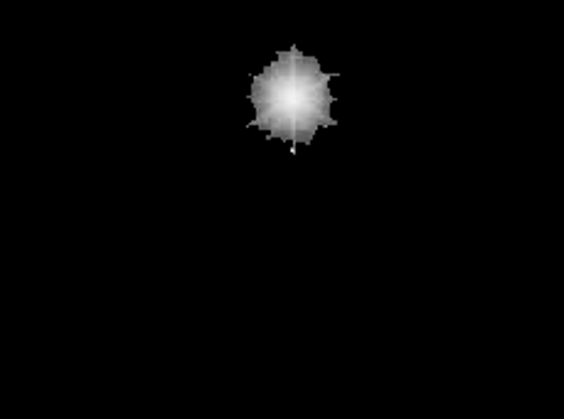

# MATLAB Image Enhancement Toolkit (Spatial Domain)

Developed a MATLAB-based image enhancement toolkit by implementing key spatial domain algorithms from scratch. This project demonstrates a fundamental understanding of low-level image operations and digital filtering, built **without** using any high-level "Image Processing Toolbox" functions (like `conv2`, `histeq`, etc.).

---

## 🚀 Project Modules

The toolkit is divided into three core modules, each addressing a different challenge in spatial domain image enhancement.

### 1. Histogram Equalization (Contrast Enhancement)

* **File:** `1.m`
* **Goal:** To enhance a low-contrast image (`Image1.png`) to reveal hidden details.
* **Implementation:** A generic histogram equalization algorithm was built from first principles:
     1.  Read the image and compute its histogram (frequency of each pixel intensity).
     2.  Calculate the Probability Density Function (PDF) and Cumulative Distribution Function (CDF) from the histogram.
     3.  Transform the original pixel intensities by mapping them to new values based on the CDF, effectively "stretching" the histogram to cover the full 0-255 intensity range.
* **Result:** The algorithm successfully enhances the low-contrast image to reveal hidden text, with the output image's histogram approximating a uniform distribution.

| Before (`Image1.png`) | After (`Image1Output.png`) |
| :---: | :---: |
|  |  |

### 2. Spatial Filtering (Noise Removal)

* **File:** `2.m`
* **Goal:** To implement a custom spatial filtering routine for noise removal and validate its performance.
* **Implementation:** A custom filtering engine was built to perform **manual convolution and correlation**.
     * This function iterates a filter mask (kernel) over every pixel in the image.
     * At each pixel, it computes the sum of the products of the kernel weights and the corresponding neighborhood pixel intensities.
     * This from-scratch implementation avoids `conv2` and other built-in filtering functions.
* **Result:** The filter successfully processes the image, and its effectiveness can be validated (as per the assignment) by comparing the edge maps of the original and filtered images.

| Before (`Image2.png`) | After (`Image2Output.png`) |
| :---: | :---: |
|  |  |

### 3. Spatial Filtering (Feature Detection)

* **File:** `3.m`
* **Goal:** To design and apply a custom spatial filter to detect and isolate a specific feature: the brightest star in an astronomical image (`Image3.png`).
* **Implementation:** A custom filter was designed to suppress background noise and enhance bright, star-like objects. This was applied using the same manual convolution engine from Part 2.
* **Result:** The output image (`Image3Output.png`) successfully isolates the target star, demonstrating the use of spatial filters for feature detection and segmentation.

| Before (`Image3.png`) | After (`Image3Output.png`) |
| :---: | :---: |
|  |  |

---

## 🛠️ Key Technical Concepts

* **MATLAB Scripting:** All algorithms implemented as standalone `.m` files.
* **Manual Algorithm Design:** All core logic was built from first principles, demonstrating a deep understanding of the underlying mathematics.
* **Pixel-Level Manipulation:** Directly accessed and manipulated pixel values in image matrices.
* **Histogram Analysis:** Manually computed and applied Probability Density Functions (PDF) and Cumulative Distribution Functions (CDF).
* **Spatial Filtering:** Implemented the complete logic for **convolution and correlation** with arbitrary kernels.
* **Strict Constraints:** Adhered to project rules by *only* using fundamental MATLAB functions (e.g., `imread`, `imwrite`, `imshow`, `imhist`) and avoiding all high-level "Image Processing Toolbox" shortcuts.

## 🚀 How to Run

1.  Open MATLAB.
2.  Place the image files (`Image1.png`, `Image2.png`, `Image3.png`) in the same directory as the `.m` scripts.
3.  Open and run the script for the desired task:
     * `1.m` (for Histogram Equalization)
     * `2.m` (for Noise Filtering)
     * `3.m` (for Star Detection)
4.  The script will process the input image and save the result as the corresponding `...Output.png` file in the same directory.